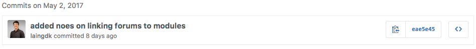
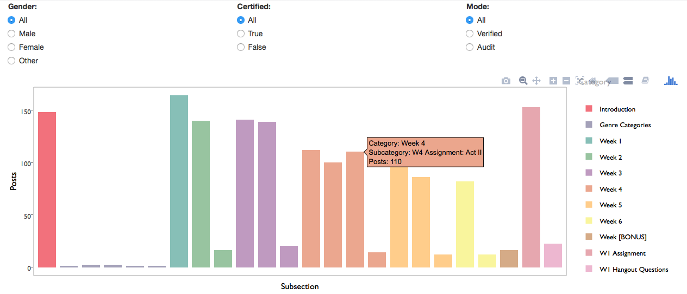
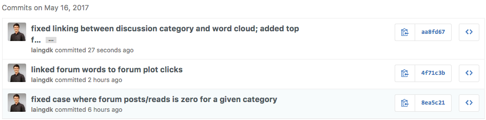
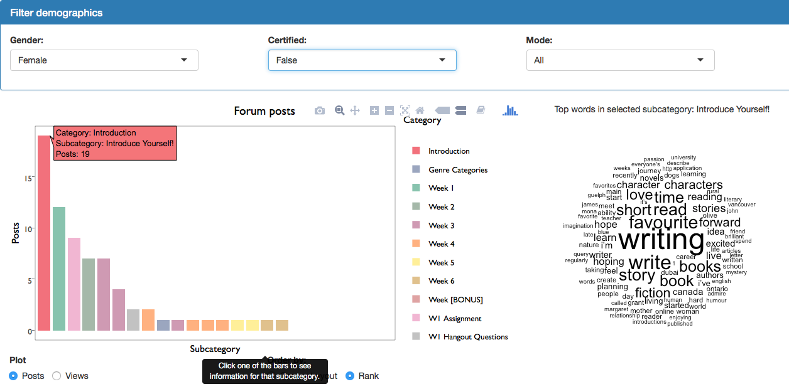
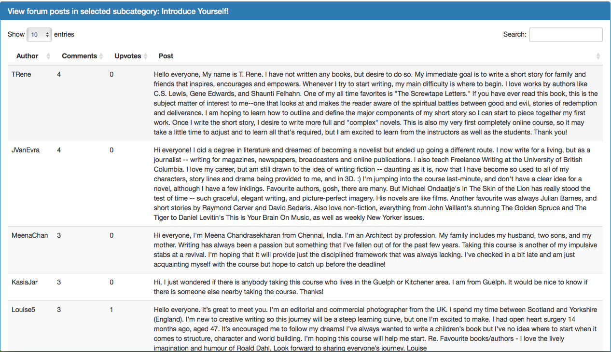
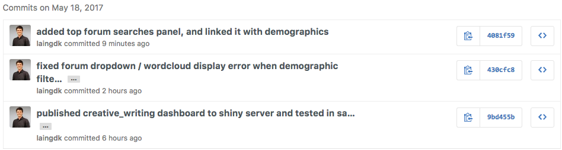
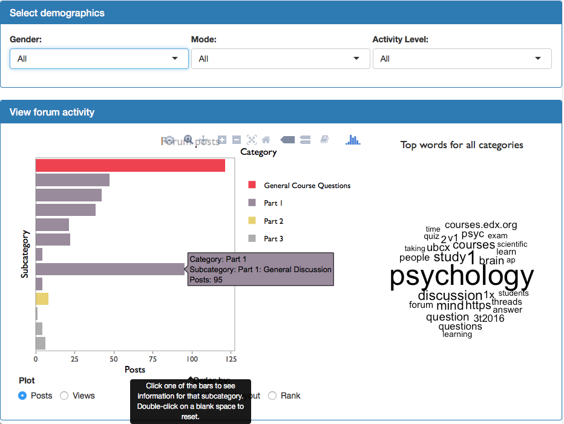

*I began keeping a daily journal on May 9th, which is why the entries before that date are a bit sparse.*

# Week 1

## Tuesday April 25

### Overview:

* I did some initial exploration of the forum data in the marketing course. In particular, I explored the sentiment of the language used in the forum.

### Git commits:

### Updates to key visualizations:

## Wednesday April 26

### Overview:

* For the first day of the hackathon, we established some goals and plans.
* We discussed the possibility of sending automated reports rather than creating a dashboard.
* I made a plot of daily active users.

### Git commits:

### Updates to key visualizations:

## Thursday April 27

### Overview:

* We had more discussions about the ideal way to present information.
* I improved the plot of the forum sentiment.

### Git commits:

### Updates to key visualizations:

# Week 2

## Monday May 1

### Overview:

* I tried some topic modelling of the forum data, using Latent Dirichlet allocation (LDA), but I found that it was very difficult to get useful and interpretable topics across different courses.

### Git commits:

## Tuesday May 2

### Overview:

* I made a first attempt at linking the forum posts with specific categories in the discussion forum.

### Git commits:

## Wednesday May 3

### Overview:

* I figured out how to link the forum posts with the categories/subcategories, and made some visualizations of the most-used words.

### Git commits:

### Updates to key visualizations:

## Friday May 5

### Overview:

* I edited and submitted the capstone proposal.

### Git commits:

# Week 3

## Monday May 8

### Overview:

* Mainly, I prepared for the proposal presentation.
* I also developed an alternative visualization of the most-used words throughout the discussion forum subcategories. It is based on text visualizations made by [Netlytic](https://netlytic.org/home/).

### Git commits:

### Updates to key visualizations:

## Tuesday May 9

### Overview:

* I made my forum wrangling code more generalizable across courses, and added filtering functionality to the forum dashboard.

### Git commits:

## Wednesday May 10

### Overview:

* I parsed the XML file containing the correct order of the forum elements, and joined that with the JSON file containing the ids of each forum elements.
* I fixed the factor ordering, which took way longer than expected.

### Git commits:

### Updates to key visualizations:

### Top priority for next day:

* Convert code in Rmd to R scripts for automatic preprocessing of forum visualizations.

## Thursday May 11

### Overview:

* As a team, we wrote a Google doc containing data/task abstractions for each visualization.
* As a team, we cleaned up Trello board and reassigned sprint tasks for next week.
* We met with Sarah, who helped us prioritize visualizations.
* I successfully generalized the forum wrangling to Climate Change, Marketing, Useful Genetics, and Creative Writing.
* I converted forum wrangling code into a clean, organized script.

### Git commits:

### Top priority for next day:

* Get read events for forum sections.
Over the weekend:
* Try to remake the forum posts plot in D3.
* Try to prototype a dashboard in D3, if possible.
* Go back through notebook and fill in gaps.

# Week 4

## Monday May 15

### Overview:

* We had a long meeting in the morning with Ido and Sarah to pin down the most important plots that need to be made.
* In the afternoon, I worked on getting the number of read events for each discussion category, and then built a prototype of a dashboard for the forum data.

### Git commits:

### Updates to key visualizations:

### Top priorities for next day:
* Fix cases where there are zero reads/posts for a given category.
* Add wordcloud to dashboard?

## Tuesday May 16

### Overview:
* I fixed the cases where there are zero reads/posts for a given category.
* I added a wordcloud to the dashboard, and linked it with the discussion subsections.
* I displayed the forum posts in the dashboard (currently no linking or smart ordering).

### Git commits:

### Updates to key visualizations:

### Top priorities for next day:

* Test out the dashboard with other courses.
* Try using Matt’s BigQuery script.
* Re-run database query but include number of likes/pins, so that I can display interesting posts in each discussion category.

## Wednesday May 17

### Overview:

* I redesigned my SQL queries so that the forum data includes the number of upvotes, reads, and dates.
* I wrangled each of the new forum datasets.
* For each course, I loaded the wrangled data into the dashboard.
* I displayed the top forum posts in the dashboard.
* I added an option for reordering the forum subcategories by their rank, which caused a million bugs, most of which I managed to squish.

### Git commits:

### Updates to key visualizations:
  

### Top priorities for next day:

* Test my dashboard in the course sandbox.
* Fix bug where the dashboard crashes when the filtered demographics contain no users.

## Thursday May 18

### Overview:

* I tested my dashboard in the course sandbox.
* I fixed several bugs related to cases when the filtered demographics contain no users.

### Git commits:

### Updates to key visualizations:

### Top priorities for next day:

* Get feedback from everyone on the forum dashboard.

# Week 5

## Tuesday May 23

### Overview:

* I made a few tweaks to the forum dashboard, republished it, and sent it to Ido for feedback.
* Much of my day got derailed by the STAT teaching presentation and lunch, which occupied me from 10:45am to around 2:00pm.

### Git commits:

### Updates to key visualizations:

### Top priorities for next day:

* Work with Matt to get the BigQuery script working.
* Determine my next major tasks.
* (Possibly work on displaying the selected subcategory on the main plot?)

## Wednesday May 24

### Overview:

* Matt wasn’t in today, so I couldn’t work with him to get the BigQuery script working.
* I tested out my code on a few more courses.
* I tried to download all the data for the marketing course, but ran into an authorization issue with BigQuery, so I asked Ido and Sarah what to do – no response yet.
* I spent a few hours in the afternoon trying to access the video transcripts, to no avail.

### Git commits:

### Top priorities for next day:

* Get feedback from Sarah on forum view of dashboard.
* Try out the shiny dashboard in Azure.

## Thursday May 25

### Overview:

* I got feedback from Sarah on my forum dashboard.
* I went out for lunch with the UX designer at Thinkific, and got some advice.
* I had a bad headache, so I had to end the day early.

# Week 6

## Monday May 29

### Overview:

* We spent most of the morning in a meeting with Ido, Sarah, and two of the learning analytics people at UBC. We showed them what we’ve made so far, and got some feedback. They seemed quite pleased with our progress so far.
* In the afternoon, I worked with Matt to get the BigQuery script working, and it is now functional. This was a major step forward, as I can now use the full dataset for a given course.
* I tested the forum view of the dashboard with the full data for the marketing course; it loads and updates slower than I’d like, but it’s definitely functional.
* I made a few minor changes to the forum view, as per feedback from Ido and Sarah.

### Git commits:

### Top priorities for next day:

* Get the forum view working for the psychology course.
* Add additional filtering options.
* Start scheduling user-testing.
* Write paragraph to describe our presentation to LAVA group.

## Tuesday May 30

### Overview:

* I wrote the description of our LAVA presentation, and sent it to Ido.
* I got the forum view working for the psychology course.
* I added two new filtering options: age, and activity level.
* I asked Ido and Sarah about scheduling user-testing.

### Git commits:

### Updates to key visualizations:

### Top priorities for next day:

* Write user-testing protocol.

## Wednesday May 31

### Overview:

* I removed language filtering, and fixed the size and font of the wordcloud title. I also added a tooltip to the forum posts dropdown.
* I wrote a draft of the user-testing protocol.

### Git commits:

### Updates to key visualizations:

### Top priorities for next day:

* Add help buttons and pop-ups.
* Add language filtering.
* Create a Google Sheets template for collecting feedback from user-testing sessions.
* Investigate R package/module creation options.

## Thursday June 1

### Overview:

* We had our first user-testing session this morning. It went pretty well, but it also made it clear that several changes were required for the forum view. We spent a fair bit of time talking as a team about all the improvements that needed to be done.
* I spent many hours in the evening trying to implement some seemingly simple changes, but had a lot of trouble with bugs in plotly. I ended up updating shiny, plotly, and ggplot, which introduced new bugs in plotly, so I think I’m stuck with ggplot now. So now I’m trying to remember how to get a click event to stay updated, and not reset to NULL. It’s been very frustrating.

### Git commits:

### Updates to key visualizations:

### Top priorities for next day:
* Continue working on click events problem.

# Week 7

## Monday June 5 (and weekend)

### Overview:

* I worked many hours over the weekend to come up with a new solution for aggregating and displaying the data using ggplot. I think it was for the better; it should now be much clearer to the user what level of aggregation they’re viewing, and also which category has been selected.
* This morning I had a meeting with Letitia to get feedback on our user-testing protocol, which was helpful. In the afternoon we had a meeting with Derek and Pan to discuss deployment, and then after that we had another usability test with three TAs for the course on Systematic Program Design.
* In the evening, I implemented some changes that were shown to be necessary during the usability test.

### Git commits:

### Updates to key visualizations:

### Top priorities for next day:

* Write down Letitia’s suggestions for the dashboard.
* Starting writing the full documentation for my wrangling pipeline.

## Tuesday June 6

### Overview:

* We had another full day of meetings, and I had a bit of time in the evening to clean up my dashboard appearance a little bit more. I ditched click interactions because they were causing too much trouble and nobody was using them. I also move the category filter down to the main plot panel, and made the logic of the category/subcategory hierarchy more obvious. I also added author counts, and truncated the thread text.
* I also discovered a bit of an oversight with regard to the hierarchy of the posts themselves. I realized that when I was filtering by a subcategory, I was only getting initial posts, not response posts or comments (whereas when all categories were selected, I was getting everything). I will have to revisit my wrangling/SQL scripts so that I can infer the commentable_id for the response posts and the comments.

### Git commits:

### Updates to key visualizations:
  

### Top priorities for next day:

* Revisit the wrangling/SQL scripts and see if I can infer the commentable_id in a smart and easy way
* Start mapping out a plan for documentation of my wrangling script and my server/ui. Also look at Matt’s code so that I can organize the shiny code into modules.

## Wednesday June 7

### Overview:

* We gave our presentation to the LAVA group today, and it went very well. We got some valuable feedback, and most of the suggestions were for minor changes.
* I started mapping out the hierarchy of the forum data today, and rewrote the SQL query for the forum_posts query, though I haven’t tested it yet. Once I get this data in the new form, I think it will be pretty easy to infer the commentable IDs of each response post and comment.

### Git commits:

### Top priorities for next day:

* Rewrite the forum_views SQL script so that I can infer the commentable_id of every view, and then (if time) incorporate this into the wrangling script.

## Thursday June 8

### Overview:

* I had a very productive day (and night). I rewrote the sql scripts, rewrote the wrangling scripts, and updated the dashboard to incorporate the different types of forum posts. It ended up being relatively complicated, but I think it’s at the point now where it’s reasonably robust.

### Git commits:

### Updates to key visualizations:

### Top priorities for next day:

* Documentation and testing.

# Week 8

## Monday June 12

### Overview:

* I made some minor changes to the forum dashboard, and otherwise spent most of my time shuffling files and functions around to get them in the right locations for the release of the R package.
* I read up on testing in R, and I set up a template file where I can write my unit tests, but I’m holding off on the tests themselves until we’ve all decided what course to use for our sample dataset, because I’m going to have to create some fake data.

### Git commits:

### Updates to key visualizations:

* I italicized the category/subcategory names in the plot titles.

### Top priorities for next day:

* Create a detailed diagram of the forum data pipeline.

## Tuesday June 13

### Overview:

* Today I mainly worked on creating diagrams to help explain the hierarchy of the discussion forum and the forum data cleaning pipeline.
* I also wrote an R wrapper for running bash scripts, and did a bit of reading about deploying to Azure.

### Git commits:

### Updates to key visualizations:

### Top priorities for next day:

* Write tests for most-used functions.

## Wednesday June 14

### Overview:

* I made sample CSVs for forum_posts, forum_views, and forum_searches.
* I added the forum module and server to the global dashboard.
* I wrote tests for three of the functions in the forum wrangling script.

### Git commits:

### Top priorities for next day:

* Continue writing tests.

## Thursday June 15

### Overview:

* Today ended up being a day of bug fixing, since there were a whole bunch of unexpected complications with rendering the forum view as its own UI.
* I’m currently stuck trying to update the selectInput for the subcategory when the category changes. I’m genuinely unsure about how to fix it. 

### Git commits:

### Top priorities for next day:

* Fix the shiny modules + selectInput problem.

# Week 9

## Monday June 19 (and weekend)

### Overview:

* Over the weekend, I fixed the shiny modules + selectInput problem that arose when we all combined our dashboards into a single dashboard. I also wrote tests for all my wrangling functions, and for most of my server functions.
* Today, I finished writing tests for my server functions, and then spent most of the afternoon learning how bookdown works, for a nicer presentation of my notebook and final report.
* I also briefly explored the `packagedocs` package, which I think we can use to automatically create a website using github pages to host all our documentation. It can also be integrated with TravisCI.

### Git commits:

### Top priorities for next day:

* Get a `packagedocs` website up and running for our documentation.
* Include all my code in this book.

## Tuesday June 20

### Overview:

* Today I mainly worked on including function documentation in this report.
* I didn't get a `packagedocs` website up, because I didn't have time to coordinate with Andrew, but we should be able to do that tomorrow or Thursday.

### Git commits:

### Top priorities for next day:

* Do a really good job of presenting our dashboard to the CTLT.
* Try to get a `packagedocs` website up.

## Wednesday June 21

### Overview:

### Git commits:

### Updates to key visualizations:

### Top priorities for next day:

## Thursday June 22

### Overview:

* We gave a presentation to the CTLT today, and then went out for lunch with Ido and Sarah.
* In the afternoon we attended a learning analytics presentation that Ido and Leah were giving. There wasn't much time left for work after that.

### Top priorities for next day:

* Fix the bug in the responses/comments counts.
* Documentation.

## Friday June 23

### Overview:

* Because of a change that Matt made, which will allow us to host multiple courses on one server, I had to change a few things in my forum server module. Namely, I had to read in the csvs as reactive files. This didn't take too long.
* The bulk of my day, i.e. 11:30am to 11:00pm, was spent trying to fix a nasty bug that I found yesterday morning before the presentation. The number of responses and comments in the threads table wasn't matching the numbers shown in the main barplot. I eventually figured it out.

### Git commits:

### Top priorities for next day:

* Replace forum titles with forum text, as per Ido's request.
* Write a paragraph to explain the forum hierarchy.
* Write a paragraph to explain the the forum wrangling.
* Write 2-3 paragraphs to justify the visualizations.
* Compile all this documentation in the R package.
